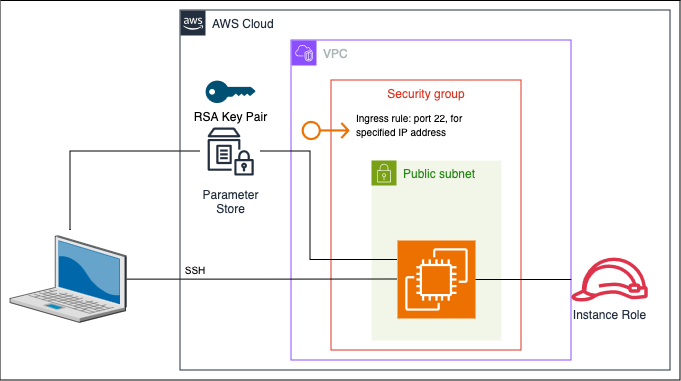

The AWS CDK app here creates a single EC2 instance which can be accessed using SSH from a shell.



# Deploying
The CDK app is deployed using `cdk deploy`.  
Environment variables need to be in place to configure the app.  

## Environment variables
A `.env` file is used to set environment variables.  
A [Pydantic Settings](https://docs.pydantic.dev/latest/concepts/pydantic_settings/) class is used to get the variables when instantiated.
The `StackParameters` class (found in `parameters/from_environment.py`), is that class.
Look at it to see what environment variables are needed in the `.env` file.  

## Helpful
[Finding an AMI](https://docs.aws.amazon.com/AWSEC2/latest/UserGuide/finding-an-ami.html).  

# Accessing the Instance
To use the instance (SSH into it) we need the public DNS name of the instance and the SSH key.  

## Get the SSH key
Find the name of the key in SSM.  
```shell
aws ssm describe-parameters
```
Download the key.  
This command outputs the key text to a file called `ec2ssh.pem`.  
```shell
aws ssm get-parameter --name <keyname> --with-decryption --query 'Parameter.Value' --output text > ec2ssh.pem
```

## Get the instance's public DNS name
```shell
aws ec2 describe-instances --query 'Reservations[*].Instances[*].[InstanceId, InstanceType, State.Name, KeyName, PublicIpAddress, PublicDnsName]' --output table
```
## Access the instance
The command used depends on the AMI.  
```shell
ssh -i 'ec2ssh.pem' ec2-user@<instance-public-dns-name>
```
OR
```shell
ssh -i 'ec2ssh.pem' ubuntu@<instance-public-dns-name>
```
Credits to https://github.com/cloudbrilliant/cdk-ec2 for a lot of this code.  